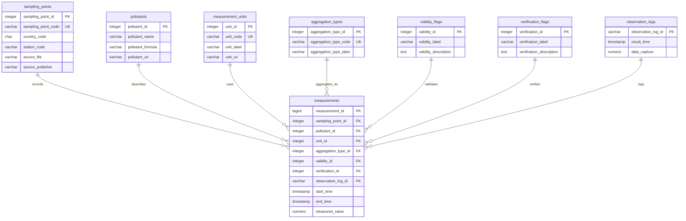

# Entity-Relationship Diagram

## 3NF Rationale

The raw EEA files contain hourly NO2 measurements with repeated values for sampling point, pollutant, unit, aggregation type, validity, verification, and observation log. The schema separates these repeated concepts into reference tables and stores the numeric observation itself in `measurements`.

This design avoids update anomalies and keeps each non-key attribute dependent on the key of its own table. For example, the unit label and future unit URI are stored once in `measurement_units`, while each measurement references that unit by key. The `measurements` table keeps only observation-specific facts: time interval, measured value, and references to the related entities.

## Source Data Summary

- Raw files: 16 station-specific Parquet files
- Rows: 140,160 hourly observations
- Sampling points: 16
- Pollutant code: 8, interpreted as nitrogen dioxide (NO2)
- Unit: `ug.m-3`
- Aggregation type: `hour`
- Validity values: `-1`, `1`
- Verification value: `1`
- Time range: 2024-01-01 00:00 to 2024-12-31 00:00
